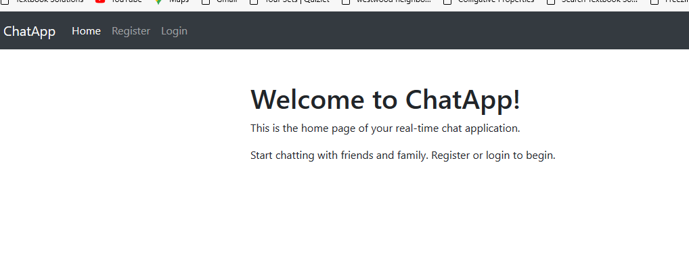
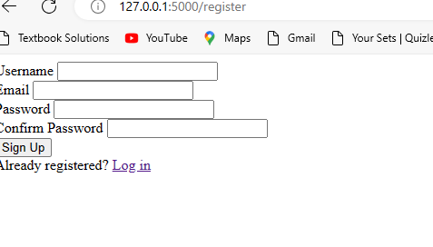
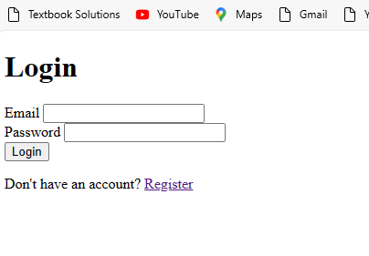

Notes for project setup 

1. Download and Install SQL Express in your local PC 
    - I did this on Windows PC 
2. Install SQL Management Studio .. UI for accessing SQL database 

3. Once you install , You can connect to your SQL database from management studio 
   Use Windows authentication for making this easy 

   - Go ahead and create a database called WebChat
------------------------------------------------------------------------------------

4. Install Python 3.6 or above - I am using 3.10 

5. Download this project folder and extact all files in a directory of your choice 

6. You can use any editor of choice but I am using Visual studio code 

7. Assuming you had visual studio code , Go to File , open the project folder 
   All files should appear in the navigation 

8. Click Terminal in visual studio , a terminal shoudl pop up (load at the botton part of the screen)

8. Create virtual environemnt as follows on this terminal 
If you are using commandline  
cd path\to\GitHub\ChatApp
.\venv\Scripts\activate

If Poershell (most likely the case with visual studio code)
cd path\to\GitHub\ChatApp
.\venv\Scripts\Activate.ps1

Maac
cd path/to/GitHub/ChatApp
source venv/bin/activate

9. Run this (pip install -r requirements.txt)
- It should install all packages needed for python and flask app

10. 
$env:FLASK_APP = "run.py"
flask run

At this point , it should run and you will get a URL which you can put in browser 
Make sure you update the database connection details in the config.py file 

Click Register button at the top left 

fill in the details and hit sign up 

If you get success, a record will be commited in the datbase table (user)

12. Click login to see whether the user we just created gets authenticated 

If the record was created, it should be able to login 

